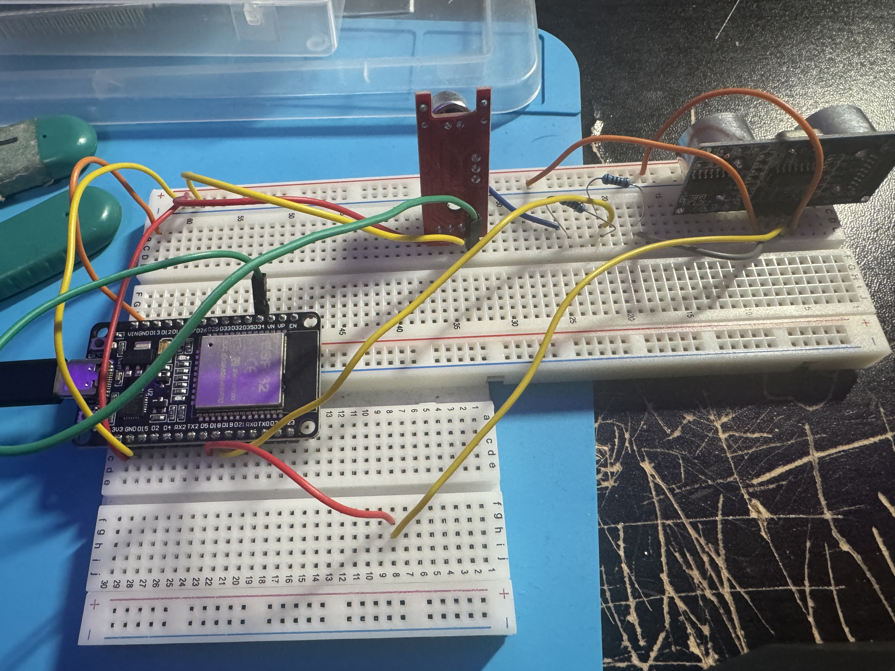
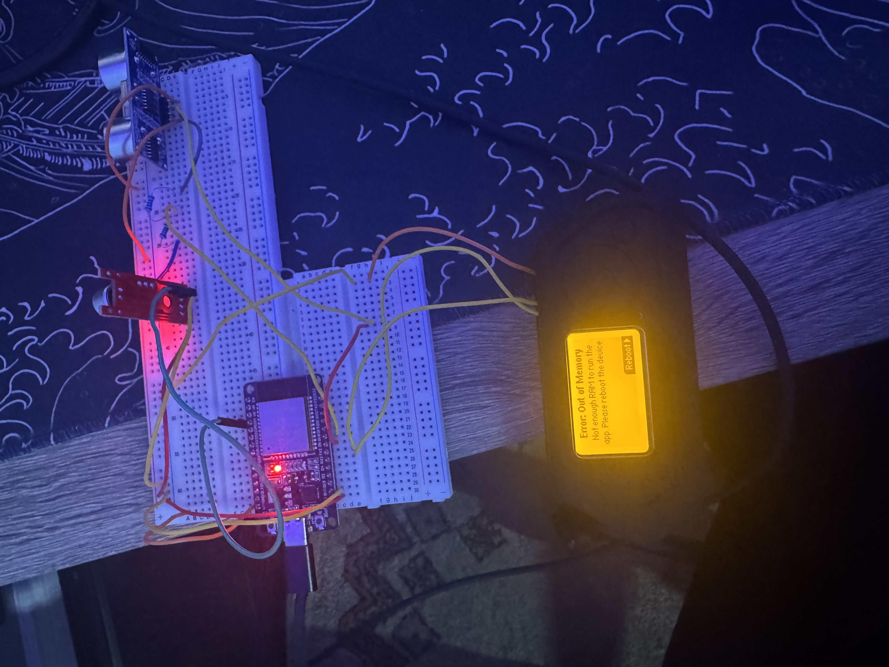

# Dual-Sensor Security Monitor

A hardware security monitor that detects intrusion events using two sensors. Built to explore how the Flipper Zero can interface with microcontrollers like the ESP32 over UART.

---

## What It Does

The system watches two things at once, distance and sound. When something gets close and  it's loud at the same time, the system triggers an alert. All live data streams to the Flipper Zero which acts as a handheld wireless monitor and control panel for the system.

- **HC-SR04** ultrasonic sensor measures distance in cm
- **KY-038** sound sensor measures ambient sound level
- **ESP32** reads both sensors, runs the alert logic, and streams telemetry
- **Flipper Zero** displays live readings and lets you adjust thresholds and arm/disarm the system using its physical buttons

---

## Hardware

| Component | Purpose |
|---|---|
| Elegoo ESP32 | Main microcontroller |
| Flipper Zero | Wireless monitor and control terminal |
| HC-SR04 | Ultrasonic distance sensor |
| KY-038 | Sound/microphone sensor |
| 1kΩ + 2kΩ resistors | Voltage divider for HC-SR04 ECHO pin |
| Breadboard + jumper wires | Wiring |

---

## Wiring Overview



| ESP32 Pin | Connected To |
|---|---|
| D34 | KY-038 A0 |
| D5 | HC-SR04 TRIG |
| D18 | HC-SR04 ECHO (via voltage divider) |
| D16 (RX2) | Flipper Zero Pin 13 (TX) |
| D17 (TX2) | Flipper Zero Pin 14 (RX) |
| 3V3 | KY-038 VCC |
| VIN (5V) | HC-SR04 VCC |
| GND | Common ground (all components + Flipper Pin 18) |

**Note on voltage divider:** The HC-SR04 ECHO pin outputs 5V but the ESP32 GPIO max is 3.3V. A voltage divider using a 1kΩ and 2kΩ resistor in series steps this down safely before it reaches D18.

---

## How the Alert Logic Works

```
IF distance < threshold (default 40cm)
AND sound > threshold (default 600 raw ADC)
AND system is armed
THEN trigger alert
```

Both conditions must be true at the same time. This avoids false positives from sound alone or movement alone.

Raw sensor readings are smoothed using an exponential moving average before the check runs, which filters out noise spikes.

---

## Flipper Zero Controls

| Button | Action |
|---|---|
| Up | Distance threshold +5cm |
| Down | Distance threshold -5cm |
| Right | Sound threshold +50 |
| Left | Sound threshold -50 |
| OK | Arm / Disarm |

Changes take effect on the ESP32 instantly over UART — no reupload of code needed.

---

## Issues I Ran Into

### MicroPython RAM error on Flipper Zero



When trying to run the monitor script using the uPython appon the flipper, the Flipper threw a "not enough RAM" error before the script even loaded. This was caused by the official Flipper firmware having strict memory limits for third-party apps.

To fix this issue, I flashed the Momentum community firmware which allocates more RAM to apps. After reflashing, uPython loaded and the script ran without issues.

---


## Future Plans

This project is an early exploration of how the Flipper Zero can act as a wireless interface for microcontrollers. Still figuring out the full range of what's possible but some directions I want to explore:

- **Sub-GHz transmission** — broadcast an alert packet over radio when thresholds are exceeded
- **Multiple ESP32 nodes** — one Flipper monitoring several ESP32 units across different locations
- **Arduino version** — port the firmware to an Arduino Uno to compare constraints between platforms

---

## Built With

- Arduino IDE
- MicroPython on Flipper Zero (Momentum firmware)
- Elegoo ESP32 Dev Board
